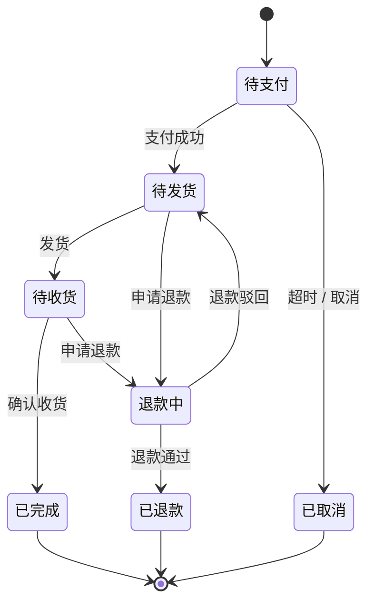

订单是电商里状态最复杂的实体。新手常用一堆布尔字段拼凑它的状态——`isPaid`、`isShipped`、`isCancelled`、`isRefunded`……然后在代码里到处 `if (isPaid && !isShipped && !isCancelled)`。这是个陷阱。

## 布尔字段拼状态为什么是坑

`n` 个布尔字段能表达 2ⁿ 种组合，但订单**真正合法的状态只有少数几个**。`isPaid=false` 同时 `isShipped=true`（没付款却发货了）是个不该存在的状态，可你的类型系统允许它，于是它迟早会因为某个 bug 真的出现。

> 用布尔位拼状态，等于把「哪些状态合法」这件事散落到每一个判断里，而不是集中声明一次。非法状态成了「能表示但不该出现」——这正是 bug 的温床。

## 用单一状态字段 + 状态机

正确做法：一个订单**只有一个 `status` 字段**，取值是一组明确的枚举；状态之间的**合法跳转**显式声明出来。



```js
const TRANSITIONS = {
  待支付:   ['待发货', '已取消'],
  待发货:   ['待收货', '退款中'],
  待收货:   ['已完成', '退款中'],
  退款中:   ['已退款', '待发货'],   // 退款驳回则回到待发货
  已完成:   [],                     // 终态
  已取消:   [],                     // 终态
  已退款:   [],                     // 终态
};

function transition(order, to) {
  if (!TRANSITIONS[order.status].includes(to)) {
    throw new Error(`非法状态流转: ${order.status} → ${to}`);
  }
  order.status = to;
}
```

任何非法跳转（已取消的单又去发货）在入口就被挡住，而不是寄希望于每处判断都写对。

## 几个关键原则

- **终态不可逆**：已完成、已取消、已退款是终点，不能再流出。把它们的可达集合设为空。
- **状态流转要落审计**：每次跳转记一条流水（谁、何时、从哪到哪、为什么），出问题能还原。订单是钱相关的实体，可追溯是底线。
- **流转要原子 + 幂等**：「校验当前状态 → 改成新状态」要在一个事务里、且配合乐观锁（`WHERE status = 当前值`），防止并发把一个单同时推向两个状态（见「幂等性」一条）。
- **状态驱动行为，而非行为驱动状态**：发货、退款这些动作应该是「状态合法流转」的结果，而不是各自直接 set 一个布尔位。

## 结论

订单天然是个状态机：有限的状态、有方向的流转、明确的终点。用一个 `status` 字段 + 一张「谁能到谁」的转移表来建模，非法状态从「能表示但不该出现」变成「根本无法表示」。这比事后用一堆 `if` 去围堵，干净得多，也安全得多。
