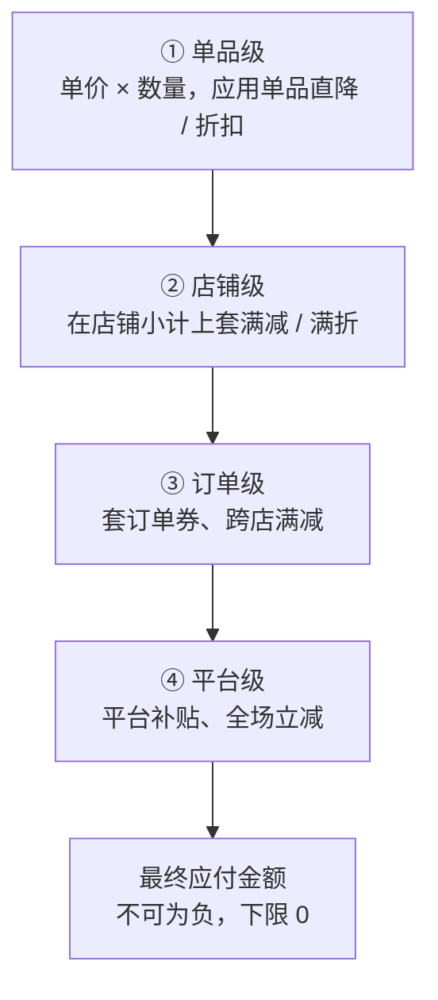

促销看着是「打个折、减个钱」，真做起来会发现：难的不是任何单条规则，而是**多条优惠叠在一起时，谁先算、谁后算、能不能共用**。顺序错一步，算出来的钱就不对。

## 优惠的几种基本类型

| 类型 | 例子 | 作用层级 |
|---|---|---|
| 单品折扣 | 第二件半价、直降 | SKU / 行 |
| 满减 | 满 300 减 50 | 订单 / 店铺 |
| 满折 | 满 2 件打 8 折 | 订单 / 店铺 |
| 优惠券 | 满 200 减 30 券 | 订单 |
| 平台补贴 | 全场立减 | 订单 |

## 顺序为什么要紧

考虑：一件 200 元的商品，有「8 折」和「满 150 减 30」两个优惠。

- **先打折再满减**：200 × 0.8 = 160，满 150，减 30 → **130**
- **先满减再打折**：(200 − 30) × 0.8 = 136 → **136**

同样两个优惠，差了 6 块。更麻烦的是「先满减」后金额可能跌破另一个优惠的门槛，引发连锁变化。所以促销引擎必须有一个**明确、固定的计算顺序**，不能让它取决于规则录入的先后。

## 一个可落地的计算管线

把优惠按「作用层级」分层，逐层套用，每层内部再定优先级：

每一层的输出是下一层的输入。这样顺序是确定的，结果可复现、可解释。

## 几个真实世界的坑

- **互斥与可叠加**：券和活动能不能同时用？同类券能不能叠？这是**规则配置**，引擎要支持「互斥组」，不能写死。
- **优惠分摊**：一个订单级的「减 30」最终要**摊回到每个商品行**上，否则退其中一件时不知道该退多少钱。分摊算法（通常按金额占比）+ 处理除不尽的**尾差**（最后一分给谁）是必做项。
- **金额不能为负**：层层减下来可能减过头，每步都要 `max(0, …)` 兜底。
- **全程用整数分**：浮点会让分摊和尾差彻底失控（见「价格：前端绝不能传价格」）。
- **券要校验归属与门槛**：能不能用、是不是这个用户的、满没满门槛、过没过期——全在服务端，前端只传券 id。

## 结论

促销引擎的本质，是把一堆**会相互影响**的优惠规则，安排进一条**顺序确定、结果可复现**的计算管线。单条规则都简单，复杂度全在组合：顺序、互斥、分摊、尾差。把这四件事想清楚再写代码，比边写边打补丁省太多事。
